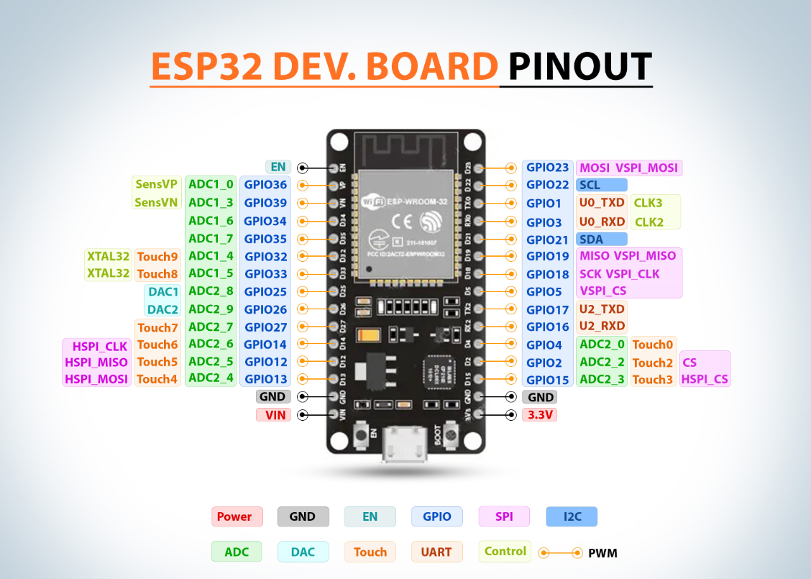
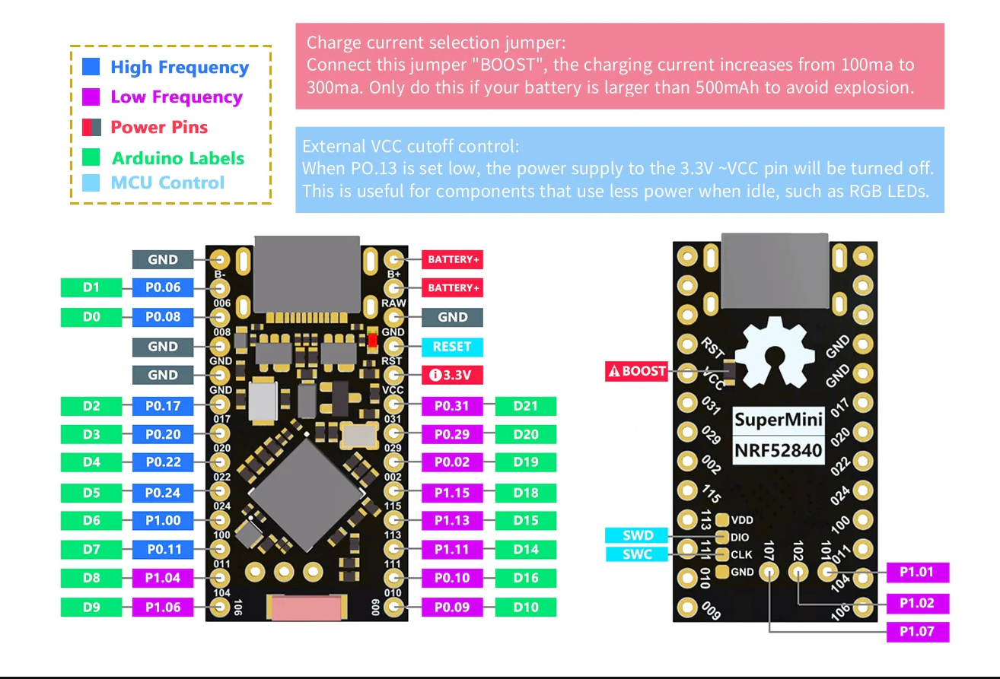

# ZMK - TRACKING FINGER TO KEYBOARD VIM





---

# Explicação dos Parâmetros do Arquivo `config.py`

Vou explicar cada parâmetro do arquivo de configuração, seu funcionamento e os valores recomendados:

## Giroscópio
```python
PORAGORA = 14000        # Limite base para thresholds
THRES_PERCENT = 0.1     # Percentual usado para criar thresholds
```

- **PORAGORA**: Valor base para os limiares (thresholds) do giroscópio.
  - Funcionamento: Define a sensibilidade do giroscópio. Valores mais altos exigem movimentos mais bruscos para serem detectados.
  - Valores recomendados: Entre 8000 (mais sensível) e 20000 (menos sensível). 14000 é um bom ponto de partida.

- **THRES_PERCENT**: Percentual de redução dos limiares para criar uma zona morta.
  - Funcionamento: Cria uma pequena margem em torno do limiar para evitar oscilações.
  - Valores recomendados: Entre 0.05 (5%) e 0.2 (20%). 0.1 (10%) é um bom equilíbrio.

## Potenciômetros
```python
THRESH_POT = [-120] * 5 # Thresholds individuais
POT_CALIBRATION_SAMPLES = 40
POT_CALIBRATION_DELAY_MS = 70
```

- **THRESH_POT**: Limiares para detecção de toque nos potenciômetros.
  - Funcionamento: Valores mais negativos exigem mais pressão para ativar.
  - Valores recomendados: Entre -50 (muito sensível) e -200 (pouco sensível). -120 é um bom meio-termo.

- **POT_CALIBRATION_SAMPLES**: Número de amostras para calibração dos potenciômetros.
  - Valores recomendados: Entre 20 (rápido) e 100 (preciso). 40 é um bom compromisso.

- **POT_CALIBRATION_DELAY_MS**: Tempo entre amostras durante a calibração.
  - Valores recomendados: Entre 50ms e 100ms. 70ms permite leituras estáveis.

## Controle de passos automáticos
```python
STEP_WAIT_LIMIT = 5     # Quantos ciclos esperar antes de repetir passo
```

- Funcionamento: Define quantos ciclos o sistema espera antes de repetir automaticamente um movimento.
- Valores recomendados: Entre 3 (rápido) e 10 (lento). 5 é um bom valor intermediário.

## Reset
```python
CYCLE_RESET_LIMIT = 20  # Quantos ciclos parado até resetar stepX/stepY
```

- Funcionamento: Número de ciclos sem movimento para resetar a posição.
- Valores recomendados: Entre 10 (rápido) e 50 (lento). 20 evita resets acidentais.

## Loop principal
```python
TSLEEP = 50             # Delay entre loops (ms)
TCLEAR = 10000          # Intervalo para reset de contador
SAMPLES = 5             # Amostras iniciais do giroscópio
```

- **TSLEEP**: Tempo de espera entre iterações do loop principal.
  - Valores recomendados: Entre 30ms (rápido) e 100ms (lento). 50ms é um bom equilíbrio.

- **TCLEAR**: Intervalo para resetar contadores internos.
  - Valores recomendados: Manter em 10000 (10 segundos) ou similar.

- **SAMPLES**: Número de amostras para média móvel do giroscópio.
  - Valores recomendados: Entre 3 (rápido) e 10 (suave). 5 é um bom valor.

## Ordem dos eixos do giroscópio
```python
GY1, GY2 = 0, 1         # Eixo X primeiro, depois Y
```

- Funcionamento: Define qual eixo do giroscópio controla X (0) e Y (1).
- Valores possíveis: 
  - `0, 1`: Eixo 0 como X, Eixo 1 como Y (padrão)
  - `1, 0`: Inverte os eixos

## DEBUG
```python
DEBUG = 0
```

- Funcionamento: Controla o nível de logs exibidos.
- Valores possíveis:
  - `None`: Mostra todos os logs
  - `-1`: Mostra apenas logs sem nível
  - `N` (número): Mostra apenas logs do nível N
  - `[N1, N2,...]`: Mostra apenas os níveis especificados

## Valores Típicos para Diferentes Cenários

1. **Para maior sensibilidade (movimentos suaves):**
   ```python
   PORAGORA = 8000
   THRES_PERCENT = 0.15
   THRESH_POT = [-80] * 5
   TSLEEP = 40
   ```

2. **Para menor sensibilidade (movimentos mais definidos):**
   ```python
   PORAGORA = 18000
   THRES_PERCENT = 0.08
   THRESH_POT = [-150] * 5
   TSLEEP = 60
   ```

3. **Para uso com crianças ou pessoas com mobilidade reduzida:**
   ```python
   PORAGORA = 6000
   THRES_PERCENT = 0.2
   THRESH_POT = [-50] * 5
   STEP_WAIT_LIMIT = 8
   ```

Recomendo começar com os valores padrão e ajustar gradualmente conforme a necessidade do usuário, testando a sensibilidade e resposta do sistema.
